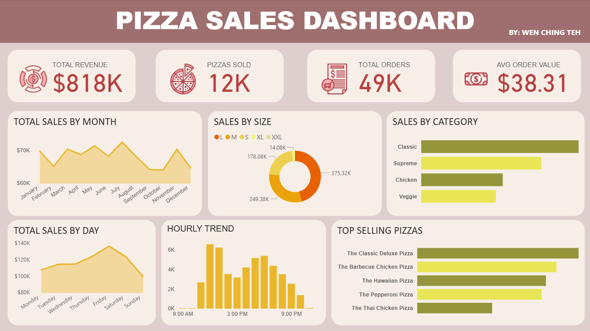

# Pizza Sales Analysis

This project explores and visualizes sales data from a fictional pizza restaurant chain. The analysis was done using SQL for data exploration and transformation, and Power BI for interactive visualizations.

## Tools Used
- **SQL** (SQLite via DBeaver): for data cleaning, transformation, and analysis
- **Power BI**: for building the interactive dashboard
- **Dataset**: [Pizza Sales Dataset on Kaggle](https://www.kaggle.com/datasets/shilongzhuang/pizza-sales)

---

## Project Structure

pizza-sales-analysis/
├── Pizza_sales dashboard.pbix
├── PowerBI_Screenshots/
│   ├── Dashboard_Full.png
├── SQL/
│   └── pizza_sales_analysis.sql
└── README.md

---

## What I learned
- How to write SQL queries using GROUP BY, SUM, ORDER BY, and LIMIT.
- How to use STRFTIME for date/time manipulation in SQLite.
- How to analyze business questions with SQL.

## Queries written
- Top 5 best selling pizzas.
- Pizza size with highest revenue.
- Average order value per order.
- Revenue trend over time.
- Best selling pizza category.
- Busiest hour of the day.
- Percentage of total sales per pizza size.
- Single pizza with highest total revenue.

## Challenges
- Formatting dates and times for correct analysis.
- Handling single-digit hours in order_time.
- Understanding SQLite string functions like substr() and instr().

## Insights
- The pizza size 'L' generates the most revenue.
- Most orders come in the hour of 12:00 (12 PM).
- The best-selling pizza by revenue is 'The Thai Chicken Pizza'.

---

## Highlights from Power BI Dashboard

> Interactive charts include:
> Total Sales by Month
> Total Sales by Day and Hour
> Sales by Size and Category
> Top Selling Pizzas

---

## Author

Made by [Teh Wen Ching]
[LinkedIn](https://www.linkedin.com/in/teh-wen-ching1905/)
